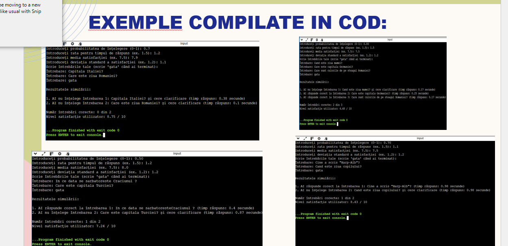

# Simularea unei Conversații AI

Acest proiect simulează o conversație între un utilizator și un AI, ținând cont de probabilitatea ca AI-ul să înțeleagă întrebările, timpul de răspuns și nivelul de satisfacție al utilizatorului.

---

## Funcționalități

- Simulează înțelegerea întrebărilor de către AI folosind probabilitatea introdusă.
- Calculează timpul de răspuns pentru fiecare întrebare pe baza unei distribuții exponențiale.
- Determină dacă răspunsul este corect sau dacă AI-ul cere clarificări.
- Simulează nivelul de satisfacție al utilizatorului pe o scară de la 0 la 10 folosind distribuția normală.
- Permite introducerea unui număr nelimitat de întrebări.

---

## Cerințe

- Python 3.x
- Module standard: `random`, `math` (nu necesită instalări suplimentare)

---

## Cum se rulează

1. Clonează sau descarcă proiectul.
2. Deschide terminalul și navighează în directorul proiectului.
3. Rulează scriptul:

```bash
python nume_script.py
---
##Exemple de rulare

